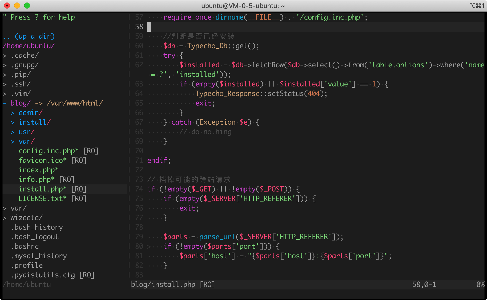

## Single file .vimrc

### Preview


### Quick Start
All you need do is:
```bash
curl -fLo ~/.vimrc https://raw.githubusercontent.com/graueneko/single-file-vimrc/master/.vimrc
```
and enjoy:
```bash
vim
```

### Usage
1. Modify any options as you want

2. After adding new plugins in Vim-Plug, run: `vim +PlugInstall +qall`(command line) or `:PlugInstall`(inside vim)

3. `Ctrl+H/J/K/L` to switch between windows.

> More usages will be updated soon